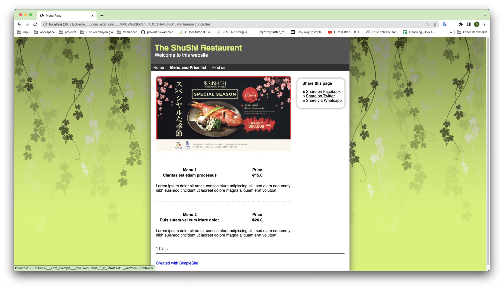
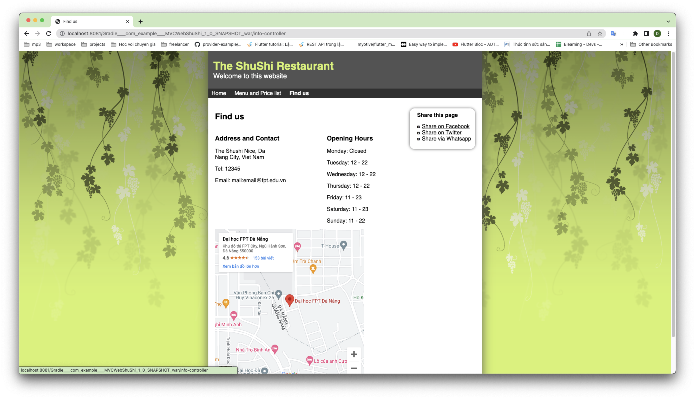
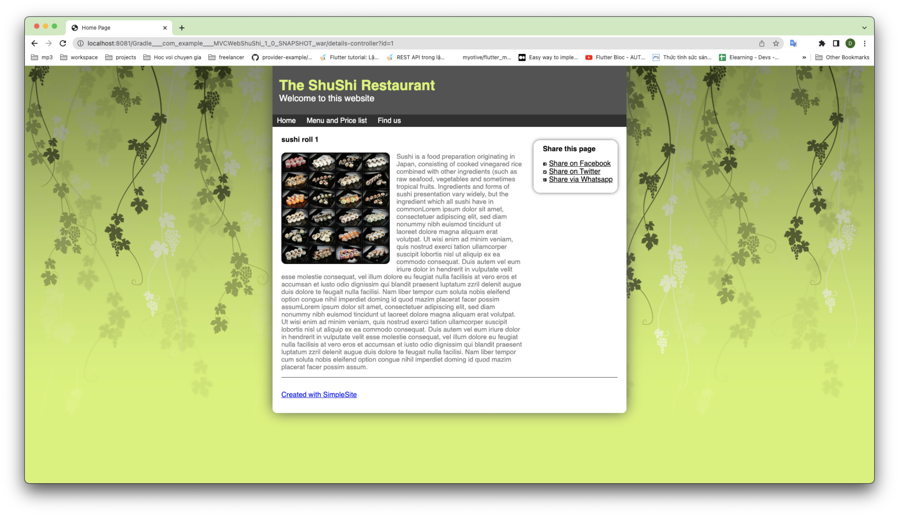

# MVCWebShuShi
# ShuShi Website Using Kotlin
### ShuShi
**Users Have Following Access for this ShuShi website:-**
- View ShuShi Products
- Select Product to Detail
- View Menu Products
- Embed location map

### Technologies used:-
1. Front-End Development:
- Html
- Css

2. Back-End Development
- Kotlin
- JDBC
- Servlet

3. Database used
- Sql/MySql

Note:- This is a basic Project so we have not think about the security and we have only implemented this project using the generic servlet

#### "Suggestions and project Improvements are Invited!"

<bold>Thanks a lot</bold> 
Project Creator 
<b>Duynn</b>

<h1>This is Home Page</h1>

<h1>This is Menu Page</h1>

<h1>This is Find Us Page</h1>

<h1>This is Detail Page</h1>

<h1>This is gif sample</h1>

